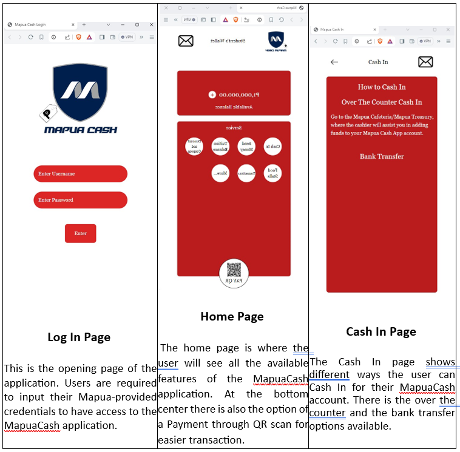
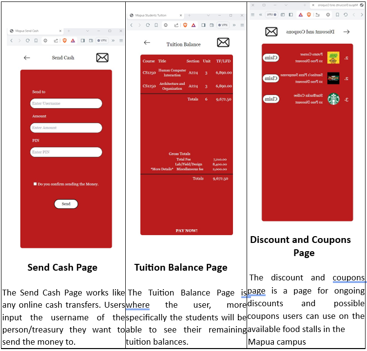
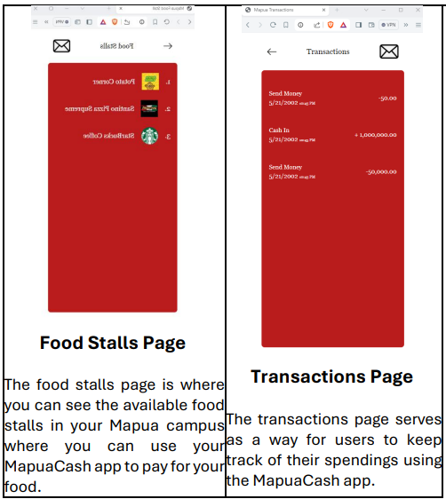

<h1 align="center"> Introduction </h1>

  

    MapuaCash stands out as an intuitive financial management tool catered specifically to
    Mapúa University students across all campuses. Its standout feature lies in its seamless 
    integration with the university's billing systems, allowing for effortless handling of 
    semestral payments, club dues, and event fees directly through the app. By centralizing 
    financial transactions, MapuaCash simplifies processes for students and university staff, 
    reducing administrative burdens. Additionally, MapuaCash provides an array of features that let students track their 
    spending, create budgets, and learn more about their spending patterns. With tools like 
    real-time spending updates and expenses categorization, students can keep on top of their 
    budget and make wise financial decisions within the campus. The software also offers 
    thorough financial reports, which helps students examine their spending habits and 
    develop money management skills. MapuaCash's intuitive interface and extensive 
    functionalities enable students to confidently manage their school finances and achieve 
    academic and personal success while attending Mapúa University.
  

 
<h1 align="center"> User-Interface and Instructions </h1>

  
  
  

